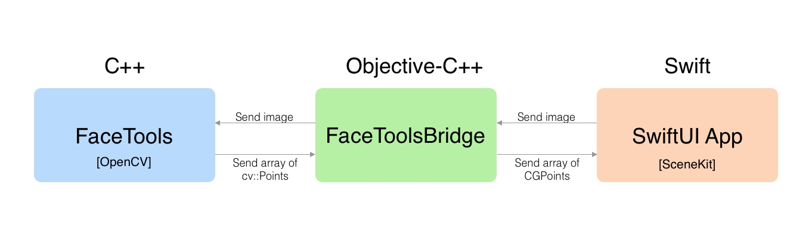
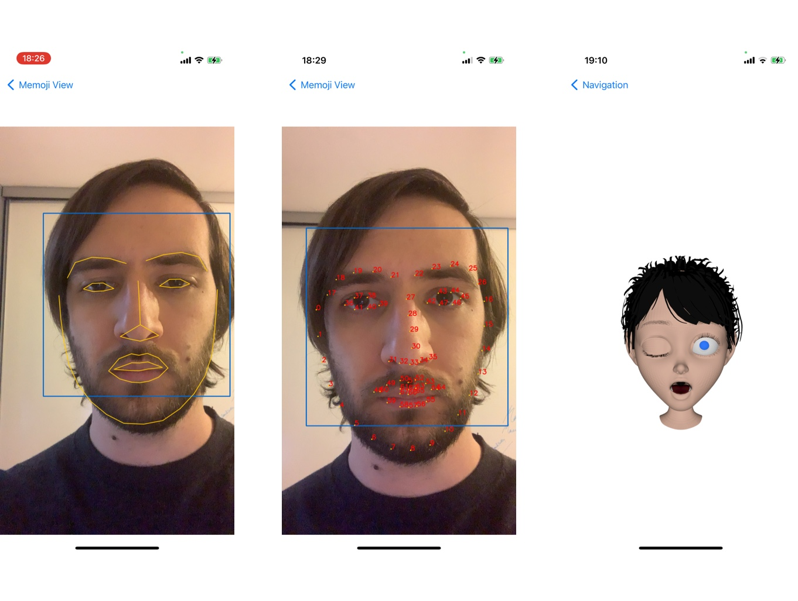
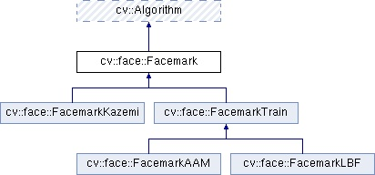

# Memoji OpenCV
Attempt to recreate Memoji without TrueDepth sensor.

## Objective
My goal was to play with OpenCV and Objective-C++ to see if I could prototype an experimental version of Memoji.

## How it started
When I was in Engineering School, I worked multiple times with OpenCV. I've done Steganography with it, as well as a hand sign detector (American Sign Language) with Machine Learning. I got curious and wanted to experiement with it to try new things.

## How it works
It is a SwiftUI App that records the front camera feed and sends it to a C++ written OpenCV program through an Objective-C++ Bridge.

## How to use it 
Run the script install-opencv.sh to download opencv and the required 3D model. The script will automatically move the files to the correct place.

Once compiled and installed, you have to hold your iPhone at 90° close to your face. A text will be displayed on the app to tell you to get closer or move away from the screen to be at the correct distance from the device.

## Result
The facial landmarks produced move too much from one image to another. This makes the result not stable enough to build an efficient face tracker for a memoji-like App. In short: **the detection is not accurate enough**.

https://user-images.githubusercontent.com/6161861/159190314-6def951e-21a2-4dc5-a667-e46ff11bbcd5.mp4

## Possible Solutions to fix it
At this point, I would start considering another approach.
But if I were to keep working on it, here are some ways to solve this problem.

### Try another cascade classifier
I use a trained model to detect faces: a cascade classifier. I took mine on the OpenCV website. I realized that even the tracking of the head is unstable. To see that, I draw a rectangle around the zone where the algorithm detected a face. The result is that the rectangle moves a lot. The facemark detector is using this as a reference to do its computation. If this reference zone changes a lot, we can assume that the result of the facemark detector will change as well from one image to another (even on a perfectly still head).
To counter that, I would try with various classifiers or even train one myself.

### Try another OpenCV implementation of landmark detection. 
I'm currently using "FaceMarkLBF" which is based on a paper titled [“Face alignment at 3000 fps via regressing local binary features"](http://www.jiansun.org/papers/CVPR14_FaceAlignment.pdf) by S. Ren published in CVPR 2014. There are two others algorithms available in OpenCV: FaceMarkAAM and FaceMarkKazemi. 

OpenCV provides two other possibilities:

FaceMarkAAM implementation uses an Active Appearance Model (AAM) and is based on a paper titled [“Optimization problems for fast AAM fitting in-the-wild”](https://ibug.doc.ic.ac.uk/media/uploads/documents/tzimiro_pantic_iccv2013.pdf) by G. Tzimiropoulos and M. Pantic, published in ICCV 2013. 

FaceMarkKazemi implementation is based on a paper titled [“One Millisecond Face Alignment with an Ensemble of Regression Trees”](http://www.csc.kth.se/~vahidk/face_ert.html) by V.Kazemi and J. Sullivan published in CVPR 2014.

Switching from one algorithm to another should be quick as those are still within OpenCV Library. If those fail to provide a better solution, I could try switching different Libraries.

### Try another Library specialized in face detection like DLIB in combination with OpenCV
OpenCV main goal is to provide tools to do Computer Vision. It's a big Library with a wide purpose and aims to cover a maximum of features. My needs are quite specific and a more efficient approach would be to use OpenCV for what it does best: Computer Vision and use another Library for landmark facial detection. There is a widely used C++ Library used for that: DLIB.

## V2: Add face orientation detection
I stopped here and did not add this feature that would allow me to animate the Memoji by following the user's face because my main goal is to experiment with the technology and to find a possible solution as if I were to prototype it in a professional context. 
Therefore I spent most of my time trying to find solutions to fix the lack of consistency of the facial landmark. But once this problem would be solved, there are features that I would like to add. One would be to add face orientation detection, and to do so by still using Computer Vision.

